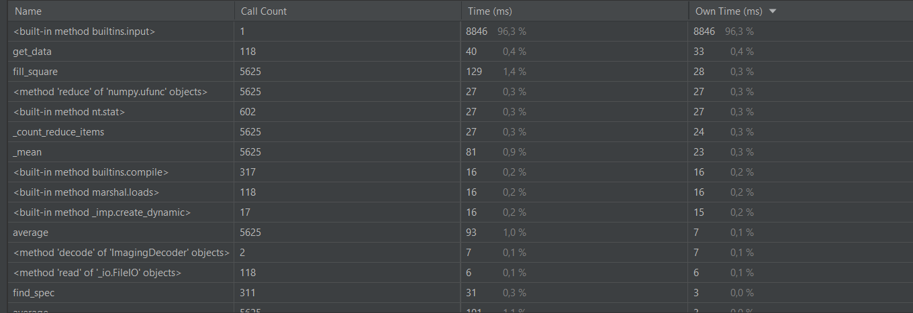
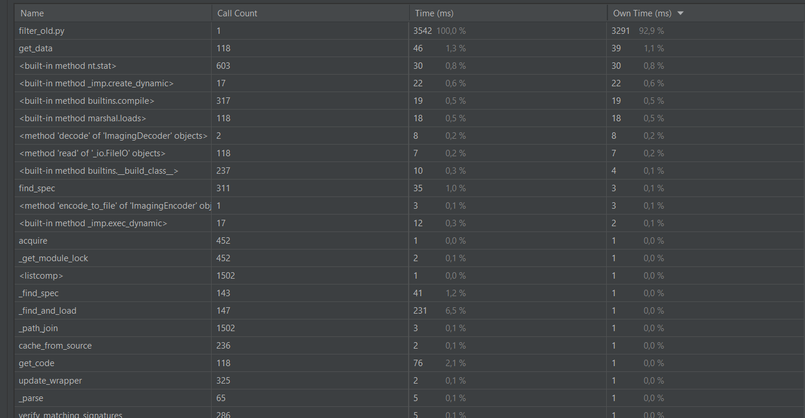
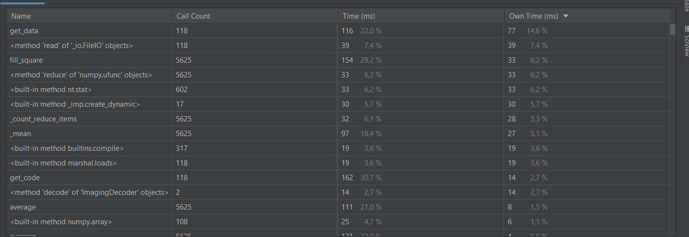
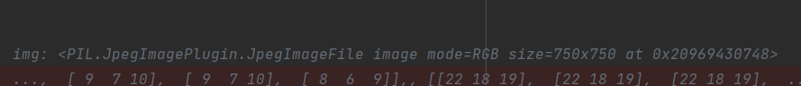
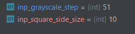

# 10TackPython
 

За счёт ожидания пользовательского ввода оптимизированный вариант выполняется дольше, но алгоритмы в нём быстрее

И правда, без пользовательского ввода картина более приятная

Результат работы программы

Свойства изображения  : ширина и высоту, а также тип изображения

Значения ширины блока и шаг градации серого